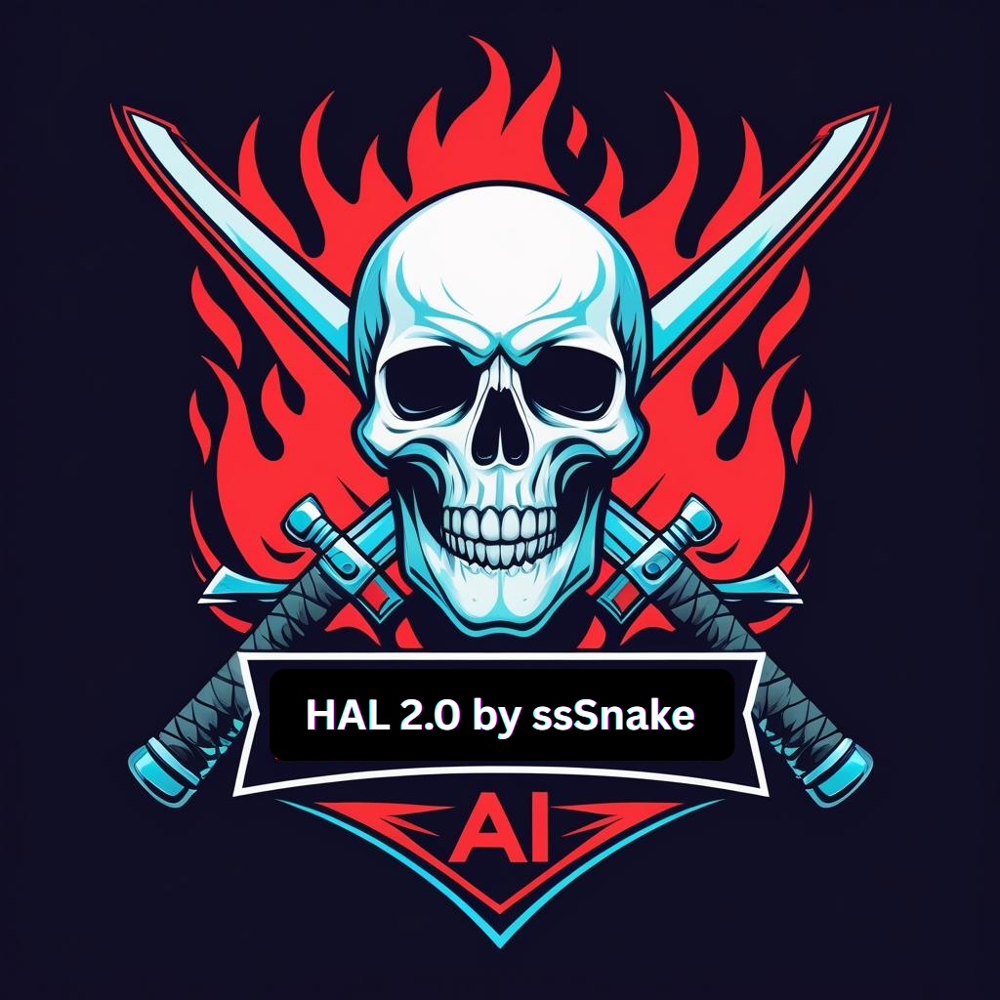

# DarkHal 2.0 🤖

<div align="center">



**Advanced AI Model Management & Training Platform**

[](https://www.python.org/downloads/)
[](https://opensource.org/licenses/MIT)
[](https://github.com/your-org/darkhal)

*Comprehensive solution for AI model downloading, management, training, and inference*

</div>

## ⚠️ DISCLAIMER

**This software is provided "as is" without any warranties or guarantees. The user assumes all responsibility for the use of this software and any consequences that may arise from its use. The developers are not liable for any damages, data loss, or other issues that may occur.**

---

## 🚀 Features

### 🔽 **Advanced Download Management**
- **Grouped Downloads**: Organize multi-file model downloads with collapsible widgets
- **HuggingFace Integration**: Direct downloading from HuggingFace Hub with authentication
- **Smart File Selection**: Choose specific files from model repositories
- **Progress Tracking**: Real-time download progress with speed monitoring
- **Resume Support**: Automatically resume interrupted downloads

### 🤖 **AI Model Management**
- **Model Library**: Intelligent scanning and indexing of local model files
- **Multi-Format Support**: GGUF, SafeTensors, PyTorch, ONNX, and more
- **Metadata Extraction**: Automatic detection of model parameters and tags
- **Quick Search**: Fast searching by name, type, size, and tags
- **GPU Acceleration**: CUDA, ROCm, Metal, and Intel GPU support

### 🎛️ **Inference & Chat**
- **Local Inference**: Run models locally without internet connection
- **Streaming Support**: Real-time text generation with streaming output
- **Chat Interface**: Interactive conversation mode with context memory
- **Parameter Control**: Adjustable temperature, context size, and token limits
- **LoRA Support**: Load and apply LoRA adapters to base models

### 🌐 **Remote Control**
- **MCP Server**: Model Context Protocol server for remote management
- **Remote GUI**: Standalone application for controlling server remotely
- **Claude Integration**: Direct integration with Claude Desktop
- **API Access**: RESTful API for programmatic control

### ⚙️ **System Integration**
- **Auto-Setup**: Automatic dependency installation and GPU detection
- **Windows Integration**: MSI installer with Windows-specific optimizations
- **Cross-Platform**: Native support for Windows, macOS, and Linux
- **Chocolatey Support**: Automated Windows dependency management

---

## 📦 Installation

### 🔧 **Quick Install (Recommended)**

#### Windows
```bash
# Download and run the MSI installer
darkhal-2.0-setup.msi

# Or install via Chocolatey
choco install darkhal
```

#### macOS/Linux
```bash
# Install via pip
pip install darkhal

# Or from source
git clone https://github.com/your-org/darkhal.git
cd darkhal
pip install -e .
```

### 🛠️ **Manual Installation**

1. **Clone the repository**
   ```bash
   git clone https://github.com/your-org/darkhal.git
   cd darkhal
   ```

2. **Install dependencies**
   ```bash
   # Basic installation
   pip install -r requirements.txt
   
   # With GPU support
   pip install -r requirements.txt darkhal[gpu]
   
   # With audio/whisper support
   pip install -r requirements.txt darkhal[audio]
   ```

3. **Run dependency installer** (Windows)
   ```bash
   python windows_dependency_installer.py
   ```

4. **Configure HuggingFace** (optional)
   ```bash
   # Create HUGGINGFACE.env file
   echo "HF_API_KEY=your_token_here" > HUGGINGFACE.env
   ```

---

## 🎯 Quick Start

### 🖥️ **GUI Mode (Default)**
```bash
# Launch with splash screen
python main.py

# Or use the installed command
darkhal
```

### 💻 **CLI Mode**
```bash
# Interactive chat
python main.py --model path/to/model.gguf

# Single prompt
python main.py --model path/to/model.gguf --prompt "Your question here"

# With GPU acceleration
python main.py --model path/to/model.gguf --n_gpu_layers 32
```

### 🌐 **Remote Control**
```bash
# Launch remote control GUI
python remotecontrol.py

# Or use the installed command
darkhal-remote
```

### 🔌 **MCP Server**
```bash
# Start MCP server
python mcp_server.py

# Or use the installed command
darkhal-mcp
```

---

## 📋 Usage Guide

### 1. **First Launch**
- DarkHal 2.0 will show a splash screen with disclaimers
- Configure your models directory in Settings
- Set up HuggingFace authentication if needed
- Scan your model library for automatic indexing

### 2. **Downloading Models**
- Go to the **HuggingFace** tab
- Search for models by name or tags
- Select desired files from multi-file models
- Downloads are organized in collapsible groups
- Monitor progress in the **Downloads** tab

### 3. **Managing Models**
- Use the **Model Library** tab to browse local models
- Search by name, file type, or tags
- View detailed metadata and statistics
- Load models directly from the library

### 4. **Running Inference**
- Select a model using "Browse" or the model library
- Configure context size and GPU layers
- Enter your prompt and click "Generate"
- Toggle streaming for real-time output
- Use chat mode for conversations

### 5. **Remote Operations**
- Start the MCP server from the main application
- Launch the remote control GUI
- Connect to the server and manage models remotely
- Integrate with Claude Desktop for enhanced AI workflows

---

## ⚙️ Configuration

### 📁 **Settings Files**
- `settings.json` - Main application settings
- `HUGGINGFACE.env` - HuggingFace API credentials
- `mcp_config.json` - MCP server configuration
- `.model_index.json` - Model library index

### 🎛️ **Key Settings**
```json
{
  "paths": {
    "models_directory": "./models",
    "download_directory": "./downloads"
  },
  "model_settings": {
    "default_n_ctx": 4096,
    "default_n_gpu_layers": 0,
    "stream_by_default": true
  },
  "download_settings": {
    "max_concurrent_downloads": 3,
    "speed_limit_mbps": 0
  }
}
```

### 🖥️ **GPU Configuration**
DarkHal 2.0 automatically detects and optimizes for:
- **NVIDIA CUDA** (Windows/Linux)
- **AMD ROCm** (Linux)
- **Apple Metal** (macOS)
- **Intel GPU** (Windows/Linux)

---

## 🔌 API Reference

### **MCP Tools**
- `list_models` - Get available models
- `load_model` - Load a model with parameters
- `generate_text` - Generate text with prompt
- `get_system_info` - Get system capabilities

### **Claude Integration**
```json
{
  "mcpServers": {
    "darkhal": {
      "command": "python",
      "args": ["path/to/mcp_server.py"]
    }
  }
}
```

---

## 🏗️ Architecture

### **Core Components**
```
DarkHal 2.0/
├── main.py                 # Main GUI application
├── splash_screen.py        # Startup splash screen
├── remotecontrol.py        # Remote control GUI
├── mcp_server.py          # MCP protocol server
├── settings_manager.py     # Configuration management
├── model_library.py       # Model indexing & search
├── grouped_download_*     # Advanced download system
└── assets/               # Icons and resources
```

### **Data Flow**
1. **User Interface** → Settings Manager → Model Operations
2. **Download Manager** → HuggingFace API → Local Storage
3. **Model Library** → File Scanner → Metadata Extractor
4. **MCP Server** → llama.cpp → Text Generation
5. **Remote Control** → MCP Client → Server Commands

---

## 🛠️ Development

### **Building from Source**
```bash
# Clone repository
git clone https://github.com/your-org/darkhal.git
cd darkhal

# Install development dependencies
pip install -e .[dev]

# Run tests
pytest tests/

# Build distribution
python setup.py sdist bdist_wheel

# Build MSI installer (Windows)
python build_installer.py
```

### **Contributing**
1. Fork the repository
2. Create a feature branch
3. Make your changes
4. Add tests and documentation
5. Submit a pull request

### **Code Style**
- Follow PEP 8 guidelines
- Use type hints where possible
- Add docstrings to all functions
- Include comprehensive error handling

---

## 📊 Performance & Requirements

### **System Requirements**
| Component | Minimum | Recommended |
|-----------|---------|-------------|
| **OS** | Windows 10, macOS 10.14, Ubuntu 18.04 | Latest versions |
| **Python** | 3.8+ | 3.11+ |
| **RAM** | 8 GB | 16+ GB |
| **Storage** | 10 GB free | 100+ GB for models |
| **GPU** | Optional | 8+ GB VRAM |

### **Model Performance**
| Model Size | RAM Usage | GPU VRAM | Inference Speed |
|------------|-----------|----------|----------------|
| **7B Q4** | 4-6 GB | 4-6 GB | 10-50 tokens/sec |
| **13B Q4** | 8-10 GB | 8-10 GB | 5-25 tokens/sec |
| **70B Q4** | 40-50 GB | 40+ GB | 1-10 tokens/sec |

---

## 🔍 Troubleshooting

### **Common Issues**

#### Installation Problems
```bash
# Missing dependencies
pip install --upgrade pip setuptools wheel
pip install -r requirements.txt

# CUDA issues
pip install torch --index-url https://download.pytorch.org/whl/cu121

# Permission errors (Windows)
# Run as Administrator or use --user flag
pip install --user darkhal
```

#### Runtime Errors
```bash
# Model loading fails
# Check file permissions and disk space
# Verify model file integrity
# Reduce context size or GPU layers

# Download issues
# Check internet connection
# Verify HuggingFace token
# Clear download cache
```

#### Performance Issues
```bash
# Slow inference
# Enable GPU acceleration
# Reduce context size
# Use quantized models
# Close other applications
```

### **Getting Help**
- 📖 Check the [Documentation](https://darkhal.readthedocs.io/)
- 🐛 Report [Issues](https://github.com/your-org/darkhal/issues)
- 💬 Join [Discussions](https://github.com/your-org/darkhal/discussions)
- 📧 Contact [Support](mailto:support@seteclabs.com)

---

## 📄 License & Legal

### **License**
This project is licensed under the MIT License - see the [LICENSE](LICENSE) file for details.

### **Third-Party Components**
- **llama.cpp** - MIT License
- **HuggingFace Transformers** - Apache 2.0
- **Tkinter** - Python Software Foundation License
- **Pillow** - PIL Software License

### **Copyright**
© 2025 Setec Labs. All rights reserved.

**Created by ssSnake**

---

## 🚀 Roadmap

### **Upcoming Features**
- [ ] **Multi-Model Support** - Run multiple models simultaneously
- [ ] **Fine-Tuning Interface** - Built-in model training capabilities
- [ ] **Plugin System** - Extensible architecture for custom tools
- [ ] **Cloud Integration** - AWS, Azure, GCP deployment options
- [ ] **Advanced Analytics** - Performance monitoring and analytics
- [ ] **Voice Interface** - Speech-to-text and text-to-speech
- [ ] **Docker Support** - Containerized deployment options
- [ ] **Model Marketplace** - Community model sharing platform

### **Version History**
- **v2.0.0** - Major rewrite with advanced features
- **v1.5.0** - Remote control and MCP integration
- **v1.0.0** - Initial release with basic functionality

---

## 🙏 Acknowledgments

Special thanks to:
- **llama.cpp team** for the excellent inference engine
- **HuggingFace** for the model hub and libraries
- **Anthropic** for the MCP protocol specification
- **Open source community** for various dependencies and tools

---

<div align="center">

**⭐ Star this repository if you find it useful!**

[**Download**](https://github.com/your-org/darkhal/releases) • [**Documentation**](https://darkhal.readthedocs.io/) • [**Issues**](https://github.com/your-org/darkhal/issues) • [**Discussions**](https://github.com/your-org/darkhal/discussions)

</div>
